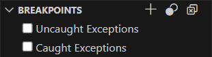


<frontmatter>
  title: "{{ title }}"
  pageNav: 2
</frontmatter>

<include src="vscode.md#wip-warning" />

# {{ title }}

This guide covers the basics of debugging Java code in VS Code.

## Prerequisites

<box type="tip" seamless>

**Need help with following prerequisites?** Check out our [Preparing VS Code for Java](vscPreparingForJava.html) guide first.
</box>

Before proceeding, ensure the following are installed:

* VS Code with the [Extension Pack for Java](https://marketplace.visualstudio.com/items?itemName=vscjava.vscode-java-pack), which includes the [Debugger for Java](https://marketplace.visualstudio.com/items?itemName=vscjava.vscode-java-debug) extension
* Java Development Kit (JDK)

## Starting a Debug Session

VS Code provides a few ways to run and debug your Java program.

### Run from Codelens

You can run or debug your Java program directly from the Codelens links that appear above the `main` method in your Java file.

### Run from Editor menu

You can also run or debug your Java program by clicking the dropdown beside the {{ icon_run }} icon from the editor context menu in the top right and selecting `Run Java` or `Debug Java`.

### Run from pressing F5

You can start a debugging session by simply pressing the `F5` key or going to the `Run and Debug` view: {{ icon_windows }}/{{ icon_linux}} `Ctrl+Shift+D` | {{ icon_apple }} `Cmd+Shift+D` from the side bar and selecting `Run and Debug`. The debugger will automatically find the entry point of your project and start debugging.

## Debugger User Interface

The VS Code debugger provides a user-friendly interface for managing breakpoints, stepping through code, and inspecting variables. The main areas include the **Debug side bar**, the **Debug toolbar**, and the **Debug Console**. 

The **Debug side bar** can be opened via {{ icon_windows }}/{{ icon_linux}} `Ctrl+Shift+D` | {{ icon_apple }} `Cmd+Shift+D`

## Debug Actions

After starting a debug session, the **Debug toolbar** provides several actions to control program execution while debugging:

| **Action** | **Description** |
|------------|-----------------|
| Continue / Pause (`F5`)   | Resume program execution until next breakpoint or end / Pause program execution to debug line-by-line. |
| Step Over (`F10`)         | Execute next line, skipping over function/method calls. |
| Step Into (`F11`)         | Enter into the function/method call on the current line. |
| Step Out (`Shift+F11`)    | Complete current function/method and return to the caller. |
| Restart (`Ctrl+Shift+F5`) | Restart the current debug session. |
| Stop (`Shift+F5`)         | Stop the debug session. |

## Setting Breakpoints

Breakpoints let you pause program execution at a specific line so you can inspect variables, call stacks, and program flow.

To set or unset a breakpoint, click on the **editor margin** next to the line number or press `F9` with the line selected.

* Breakpoints in the editor margin appear as **red filled circles** when active.
* **Disabled breakpoints** are shown as filled gray circles.
* When a debugging session starts, breakpoints that can't be registered with the debugger will appear as **gray hollow circles**.

To manage your breakpoints, you can use the **BREAKPOINTS** section in the Run and Debug side bar. Here, you can see all breakpoints in your workspace and quickly enable, disable, or remove them, as well as access additional actions.

## Breakpoint Types

VS Code supports several types of breakpoints.

### Conditional Breakpoint

A conditional breakpoint pauses program execution only when a specified condition is true. This is useful for stopping at a line only when certain variable values or expressions meet your criteria (e.g., `i == 5`).

You can set conditions based on expressions or hit counts:

* **Expression condition**: The breakpoint will trigger only when the specified expression evaluates to true.
<video src="https://code.visualstudio.com/assets/docs/java/java-debugging/conditional-bp.mp4" controls width="100%">Your browser does not support the video tag.</video>

* **Hit count**: The breakpoint will trigger only after it has been hit the specified number of times.

**To add a conditional breakpoint:**

1. Create a conditional breakpoint
    * Right-click in the editor margin and select **Add Conditional Breakpoint**, or
    * Open the Command Palette: {{ icon_windows }}/{{ icon_linux}} `Ctrl+Shift+P` | {{ icon_apple }} `Cmd+Shift+P` and enter the `Debug: Add Conditional Breakpoint` command.
2. Choose the type of condition you want to set: Expression, or Hit Count.
3. Enter your condition in the input box (e.g., `counter > 10`).
4. Press Enter to save.

**To add a condition to an existing breakpoint:**

1. Edit an existing breakpoint
    * Right-click on the breakpoint in the editor margin and select **Edit Breakpoint**, or
    * Open the Command Palette: {{ icon_windows }}/{{ icon_linux}} `Ctrl+Shift+P` | {{ icon_apple }} `Cmd+Shift+P` and enter the `Debug: Add Conditional Breakpoint` command, or
    * Select the pencil icon next to an existing breakpoint in the **BREAKPOINTS** section of the Run and Debug side bar.
2. Edit the type of condition you want to set: Expression, or Hit Count.
3. Edit your condition in the input box (e.g., `counter > 10`).
4. Press Enter to save.

### Triggered Breakpoint

A triggered breakpoint pauses program execution only after another breakpoint has been hit. This is useful for investigating issues that occur after a specific sequence of events or when you want to focus on a particular code path.

**To add a triggered breakpoint:**
1. Create a triggered breakpoint
    * Right-click in the editor margin and select **Add Triggered Breakpoint**, or
    * Open the Command Palette: {{ icon_windows }}/{{ icon_linux}} `Ctrl+Shift+P` | {{ icon_apple }} `Cmd+Shift+P` and enter the `Debug: Add Triggered Breakpoint` command.
2. Use the dropdown list to select the name and location of the other breakpoint that should activate this one.
3. Click on `OK` to save.

<video src="https://code.visualstudio.com/assets/docs/editor/debugging/debug-triggered-breakpoint.mp4" controls width="100%">Your browser does not support the video tag.</video>

### Data Breakpoint

A data breakpoint pauses program execution when the value of a specific variable or field changes/is read/is accessed. This is useful for tracking down bugs caused by unexpected changes to variables, such as when a field is modified in a way you didn't expect.

**Note:** You can only set a data breakpoint while a debug session is active. You need to first run your program and break on a regular breakpoint.

**To set a data breakpoint:**

1. Start a debug session and pause at a line where the object or field is in scope.
2. In the **VARIABLES** section of the Run and Debug side bar, right-click the field you want to watch and select `Break on Value Change/Read/Access`.
3. The data breakpoint will appear in the **BREAKPOINTS** section and will trigger whenever the value of that field changes/is read/is accessed during execution. Data breakpoints are shown with a red hexagon in the BREAKPOINTS section.

> **Tip:** You can enable, disable, or remove data breakpoints from the **BREAKPOINTS** section just like other breakpoints.

### Logpoint

A logpoint is a special kind of breakpoint that logs a message to the debug console without stopping program execution. This is useful to save time tracing code execution and inspecting variable values at specific points without interrupting the flow of your program or having to add and remove logging statements in your code.

**To add a logpoint:**

1. Create a logpoint
    * Right-click in the editor margin and select **Add Logpoint**, or
    * Open the Command Palette: {{ icon_windows }}/{{ icon_linux}} `Ctrl+Shift+P` | {{ icon_apple }} `Cmd+Shift+P` and enter the `Debug: Add Logpoint` command.
3. In the input box that appears, enter the message you want to log. You can include variable values or expressions to be evaluated in the message by enclosing them in `{}` (e.g., `Counter value: {counter}`).
4. Press Enter to save the logpoint. Logpoints are shown with a red diamon in the BREAKPOINTS section.

<video src="https://code.visualstudio.com/assets/docs/java/java-debugging/logpoints.mp4" controls width="100%">Your browser does not support the video tag.</video>

### Exception Breakpoint

An exception breakpoint pauses program execution whenever an exception is thrown, even if there is no explicit breakpoint set on the line where the exception occurs. This is useful for quickly identifying and diagnosing unexpected errors in your code or when your program crashes without a clear cause.

**To add or configure an exception breakpoint:**

1. Open the **Run and Debug** side bar.
2. In the **BREAKPOINTS** section, you can choose to break on uncaught and/or caught exceptions.

## Data Inspection

When your program is paused during debugging, you can inspect the current state of your variables and objects directly in the editor. This helps you understand how your code is behaving at a specific point in execution.

**Ways to inspect data in the editor:**

* **Inline values:** When stopped at a breakpoint, VS Code can show the values of variables inline, right next to the code.
* **Hover:** Move your mouse over any variable in the editor to see its current value in a tooltip.

### Run and Debug side bar

When the program hits a breakpoint, the editor highlights the current line. The **Run and Debug** side bar shows:

* **VARIABLES**: Current values of local and global variables.
* **WATCH**: Add variables and expressions to monitor their values as you step through code.
* **CALL STACK**: The sequence of method calls that led to the current point.

> **Note:** Variable values and expression evaluation are relative to the currently selected stack frame in the **CALL STACK** section.

You can right-click on a variable in the **VARIABLES** section and select:

* **Set Value** (or press `F2`) to change the value of a variable
* **Copy Value** to copy the current value of a variable.
* **Copy as Expression** to copy an expression that accesses the variable, which you can then use to add to the **WATCH** section.
* **Add to Watch** to add the variable directly to the **WATCH** section

> **Tip:** To search for variables by their name or value, use {{ icon_windows }}/{{ icon_linux}} `Ctrl+Alt+F` | {{ icon_apple }} `Cmd+Alt+F` while the focus is on the **VARIABLES** section and type a search term.

### Debug Console

> **Note:** You can only use the Debug Console in an active debugging session.

You can evaluate expressions in the Debug Console to inspect values, call methods, or run code snippets while debugging. 

To open the Debug Console, use {{ icon_windows }}/{{ icon_linux}} `Ctrl+Shift+Y` | {{ icon_apple }} `Cmd+Shift+Y` or open the Command Palette: {{ icon_windows }}/{{ icon_linux}} `Ctrl+Shift+P` | {{ icon_apple }} `Cmd+Shift+P`and use the `View: Toggle Debug Console` command.

Type your expression and press `Enter` to evaluate it. The Debug Console provides suggestions as you type. To input multiple lines, use `Shift+Enter` to add new lines, then press `Enter` to run all lines.

<video src="https://code.visualstudio.com/assets/docs/java/java-debugging/expression-evaluation.mp4" controls width="100%">Your browser does not support the video tag.</video>

## Hot Code Replace

Hot Code Replace (HCR) is a debugging feature that lets you update your Java code while your program is running, without needing to restart the application. When you make changes to a Java file during a debugging session, the Debugger for Java automatically sends the updated class to the running Java Virtual Machine (JVM). This allows you to experiment, fix bugs, and iterate quickly, all while keeping your program running.

<video src="https://code.visualstudio.com/assets/docs/java/java-debugging/hcr.mp4" controls width="100%">Your browser does not support the video tag.</video>

## Official References

For more information and in-depth tutorials, see the following official resources:

* [VS Code General Debugging (Official Docs)](https://code.visualstudio.com/docs/debugtest/debugging)
* [VS Code Java Debugging Guide (Official Docs)](https://code.visualstudio.com/docs/java/java-debugging)

<iframe width="560" height="315" src="https://www.youtube.com/embed/3HiLLByBWkg?si=MmuB2ni2FvFZHyu-" title="YouTube video player" frameborder="0" allow="accelerometer; autoplay; clipboard-write; encrypted-media; gyroscope; picture-in-picture; web-share" referrerpolicy="strict-origin-when-cross-origin" allowfullscreen></iframe>

<iframe width="560" height="315" src="https://www.youtube.com/embed/bccB3IhQhSg?si=dWrtRy0mE3RyASZw" title="YouTube video player" frameborder="0" allow="accelerometer; autoplay; clipboard-write; encrypted-media; gyroscope; picture-in-picture; web-share" referrerpolicy="strict-origin-when-cross-origin" allowfullscreen></iframe>
