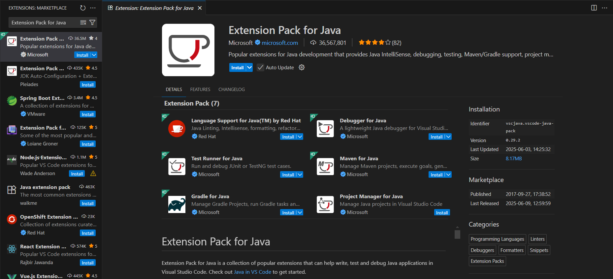
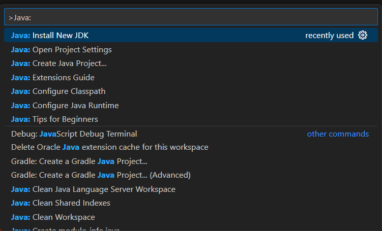
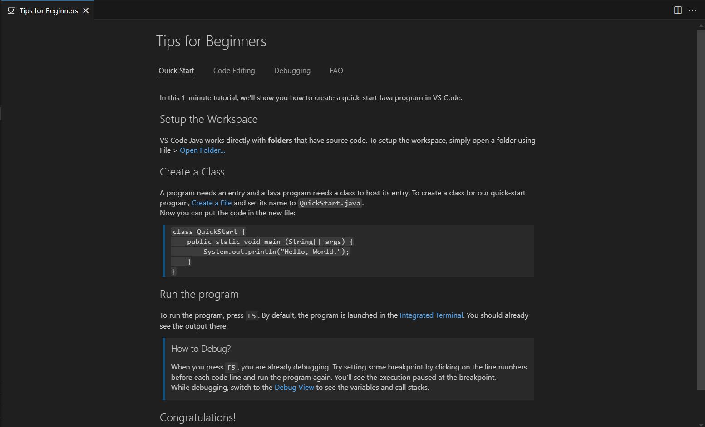
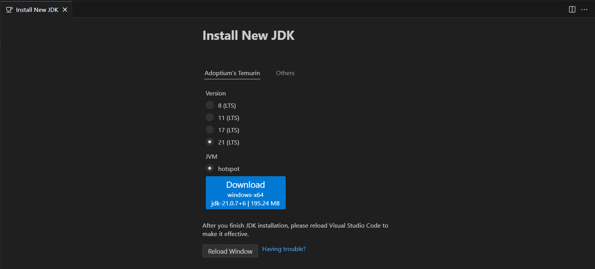


<frontmatter>
  title: "{{ title }}"
  pageNav: 2
</frontmatter>

<include src="vscode.md#wip-warning" />

# {{ title }}

<box type="info" seamless>

This tutorial is adapted from the [official VS Code Java Tutorial](https://code.visualstudio.com/docs/java/java-tutorial).
</box>

This guide will help you set up VS Code for Java development by installing the necessary extensions and configuring the Java Development Kit (JDK).

## Install VS Code

1. **Visit the official VS Code website**: [https://code.visualstudio.com/](https://code.visualstudio.com/)
2. **Click the "Download" button** - The website will automatically detect your operating system
3. Refer to the [official VS Code Setup Overview](https://code.visualstudio.com/docs/setup/setup-overview) for system-specific installation instructions.
    * [**:fab-apple: Mac**](https://code.visualstudio.com/docs/setup/mac#_install-vs-code-on-macos)
    * [**:fab-windows: Windows**](https://code.visualstudio.com/docs/setup/windows#_install-vs-code-on-windows)
    * [**:fab-linux: Linux**](https://code.visualstudio.com/docs/setup/linux#_install-vs-code-on-linux)

<box type="tip" seamless>

**First time using VS Code?**

Take a few minutes to explore the interface and try the built-in tutorials by opening the Command Palette: {{ icon_windows }}/{{ icon_linux}} `Ctrl+Shift+P` | {{ icon_apple }} `Cmd+Shift+P` and typing `Welcome: Open Walkthrough`.

You can also refer to the [official VS Code Getting Started guide](https://code.visualstudio.com/docs/getstarted/getting-started) for a comprehensive tutorial.
</box>

## Install the Extension Pack for Java

VS Code uses **extensions** to add programming language support and development tools. An **extension pack** is a bundle that contains multiple related extensions, making it easy to install everything you need for a specific programming language with just one click.

The [Extension Pack for Java](https://marketplace.visualstudio.com/items?itemName=vscjava.vscode-java-pack) is Microsoft's official bundle that includes all the essential extensions for Java development. Instead of installing each extension individually, you can simply install this pack to get everything you need for Java development in VS Code.

### Installation steps

1. **Open the Extensions View**: {{ icon_windows }}/{{ icon_linux}} `Ctrl+Shift+X` | {{ icon_apple }} `Cmd+Shift+X`
2. **Search for** `Extension Pack for Java`
3. **Click** `Install` on the extension by Microsoft

### Verify installation

To verify that the [Extension Pack for Java](https://marketplace.visualstudio.com/items?itemName=vscjava.vscode-java-pack) was installed correctly, open the Command Palette: {{ icon_windows }}/{{ icon_linux}} `Ctrl+Shift+P` | {{ icon_apple }} `Cmd+Shift+P` and type `Java:` to see available commands

<box type="tip" seamless>

**Quick tip:** After installation, open the Command Palette: {{ icon_windows }}/{{ icon_linux}} `Ctrl+Shift+P` | {{ icon_apple }} `Cmd+Shift+P`, type `Java: Tips for Beginners` and open it for helpful information to get started.

</box>

## Install Java Development Kit (JDK)

Before you can develop Java applications in VS Code, you need to have a Java Development Kit (JDK) installed.

Check out our [Java Installation guide](javaInstallation.html) for detailed installation and setup instructions for Windows, macOS, and Linux.

### Alternative: Install JDK through VS Code

VS Code can also help you install and configure additional JDK versions through its integrated tools. This method is particularly useful when you need to manage multiple JDK versions or want VS Code to handle the installation automatically.

1. **Open the Command Palette**: {{ icon_windows }}/{{ icon_linux}} `Ctrl+Shift+P` | {{ icon_apple }} `Cmd+Shift+P`
2. **Type** `Java: Install New JDK` and select it

3. **Choose a JDK version** from the available options
4. **Download and follow the installation prompts**

## Next steps

Once you have VS Code prepared for Java development, you can:

* [Create a new Java project](vscCreatingNewJavaProject.html)
* [Import an existing Java project](vscImportingJavaProject.html)
* [Import a Gradle project](vscImportingGradleProject.html)
* [Set up Checkstyle](vscSettingUpCheckstyle.html)
