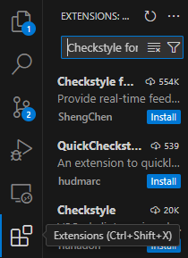


<frontmatter>
  title: "{{ title }}"
  pageNav: 2
</frontmatter>


<box type="warning" light>

**Caution: This page is a work-in-progress, containing content contributed by students.**

* If you notice any bugs or suggestions for improvements, please report at https://github.com/se-edu/guides/issues
* You are welcome to contribute by sending a PRs to https://github.com/se-edu/guides/pulls too.
</box>

# {{ title }}

This guide is for those who prefer to use [Visual Studio Code](https://code.visualstudio.com/) (VS Code) for their Java projects.

## Preparing VS Code for Java projects

1. Install the JDK needed for your project, as given [here](javaInstallation.md).<br>
   IMPORTANT: If you are on a Mac and you anticipate using JavaFX in your projects, you are using the precise JDK specified [here](javaInstallationMac.md).
1. Install the [Extension Pack for Java](https://marketplace.visualstudio.com/items?itemName=vscjava.vscode-java-pack) extension to enable support for Java extensions, if you haven't done so already.<br>
   i.e., Go to `Extensions` → Search `Extension Pack for Java` → Install.

## Importing a Gradle project

* **Verify the project has support for Gradle:** If it does, you will see a `build.gradle` file in your project root.{{ step_numbers }}
* **Open the project in VS Code**, as follows:
  * Open VS Code.{{ abcd_numbers }}
  * If you are in the welcome screen, Click `Open`. Otherwise, click `File` -> `Open`.
  * Select the project directory, and click `Open`.
* **Confirm the correct JDK is set** to the one you are supposed to use for the project, as follows:
  * Open the Command Palette: {{ icon_windows }}/{{ icon_linux}} `Ctrl+Shift+P` | {{ icon_apple }} `Cmd+Shift+P` {{ abcd_numbers }}
  * Type `Java: Configure Java Runtime` and select it.
  * Check that the JDK version matches the one required for your project. If not, you can install the required JDK and configure it. (Java installation guides: [Windows](https://se-education.org/guides/tutorials/javaInstallationMac.html) | [Mac](https://se-education.org/guides/tutorials/javaInstallationWindows.html))
* **Confirm the correct JVM is used for Gradle**, as follows:
  * Install the Gradle Extension: Search for `Gradle` in the Extensions view (`Ctrl+Shift+X` or `Cmd+Shift+X`), and install a Gradle extension if you haven’t already (e.g., [Gradle for Java](https://marketplace.visualstudio.com/items?itemName=vscjava.vscode-gradle)). {{ abcd_numbers }}
  * Open `settings.json`: You can find it by opening the Command Palette (`Ctrl+Shift+P` or `Cmd+Shift+P`), then typing `Preferences: Open User Settings (JSON)`.
  * Add or modify the following settings to configure the JVM for Gradle. Here's an example (for Mac):
    ```json { heading="settings.json" }
    {
      "java.configuration.runtimes": [
        {
          "name": "JavaSE-17",
          "path": "/Library/Java/JavaVirtualMachines/zulu-17.jdk/Contents/Home"
        }
      ],
      "java.import.gradle.java.home": "/Library/Java/JavaVirtualMachines/zulu-11.jdk/Contents/Home"
    }
    ```
  * If the Gradle icon doesn't appear after restarting VS Code, add `"gradle.nestedProjects": true` to your `settings.json` file.
* **Confirm you can access the Gradle tool window**. After the importing of the project is complete (which could take a few minutes), you will see the Gradle Tab in the VSCode interface e.g., look for the elephant icon on the left and click it.<br>
   <pic src="images/vscode/vscode_gradle_icon.jpg" width="400" />


## Setting up Checkstyle

Given below are the steps to set up a Checkstyle plugin in VS Code so that VS Code can alert you about code style problems as you write code.

* **Verify prerequisites:**: {{ step_numbers }}
  * The two Checkstyle config files (`checkstyle.xml` and `suppressions.xml`) should be in the `./config/checkstyle` directory, as mentioned [here](checkstyle.md). {{ abcd_numbers }}
  * You have downloaded the _Extension Pack for Java_, as mentioned in the section [Preparing VS Code for Java projects](#preparing-vs-code-for-java-projects) above. This is required as the Checkstyle for Java extension is dependent on [Language Support for Java by Red Hat](https://marketplace.visualstudio.com/items?itemName=redhat.java), one of the extensions in this extension pack, to work properly.
* Open VS Code.
* Download the [Checkstyle for Java](https://marketplace.visualstudio.com/items?itemName=shengchen.vscode-checkstyle) extension by author ShengChen using `Extensions` -> Search `Checkstyle for Java` -> Install (the first entry).<br>
   
* Open the project directory in VS Code using `File -> Open Folder...`.
* Set up the extension to use the project's Checkstyle files as follows:
  * Check if the `./.vscode/settings.json` file exists. If not, create a folder `.vscode` in the project root directory and add a file `settings.json` within the `.vscode` folder. This file contains configuration settings for projects in VS Code. {{ abcd_numbers }}
   * Add these configuration settings to the `settings.json` file. These settings ensure that the Checkstyle extension uses the correct configuration files in the `./config/checkstyle` directory:
     ```json { heading="settings.json" }
      {
        "java.checkstyle.configuration": "${workspaceFolder}/config/checkstyle/checkstyle.xml",
        "java.checkstyle.properties": {
          "config_loc": "${workspaceFolder}/config/checkstyle"
        }
      }    
      ```
* Add `.vscode` to your `.gitignore` if you haven't done so by adding these few lines to the end of `.gitignore`:
  ```sh { heading=".gitignore" }
  # VS Code
  /.vscode/
  ```
* Now you should be able to edit your code with Checkstyle violations being detected as you edit them in the `Problems` tab in VS Code. For example, after changing the code to add a wildcard import, you can see that the wildcard import on line 11 has been detected by the Checkstyle extension:<br>
  <pic src="images/vscode/checkstyle-vscode-example.png" width="600" />
